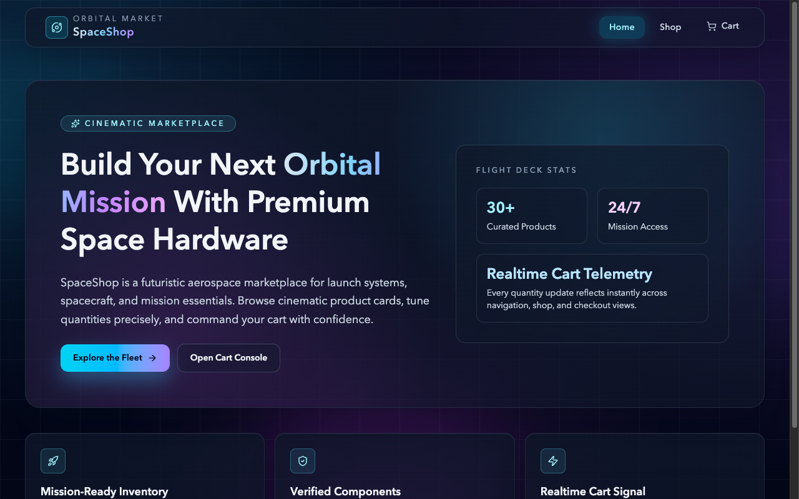

# Shopping Cart (SpaceShop)

A space-themed storefront built with React and Vite, with routed product browsing,
quantity steppers, a shared cart, and checkout review state.

🔗 **Live demo:** [shopping-cart-iota-woad.vercel.app](https://shopping-cart-iota-woad.vercel.app/)



## Features

- Routed Home, Shop, and Cart pages built with React Router.
- Product fetching and caching via TanStack React Query (with local fallbacks).
- Cart context for shared item state, totals, and quantity updates.
- Reusable shop-item, cart-item, dropdown, and stepper components.

## Tech stack

React · Vite · React Router · **TanStack React Query** · Tailwind CSS · **Vitest** (tests)

## Getting started

```bash
npm install
npm run dev          # Vite dev server
```

Other scripts:

| Script | Description |
|---|---|
| `npm run build` | Production build |
| `npm run preview` | Preview the production build |
| `npm test` | Run Vitest |
| `npm run lint` | ESLint |
| `npm run fetch-products` | Refresh local product data (`scripts/fetchData.js`) |

## What I practiced

Client-side routing, **server-state management with React Query** (caching, fetching),
sharing cart state through React context, and testing components with Vitest +
Testing Library.

## License

Odin Project coursework — original implementation by Aziz Umarov.
